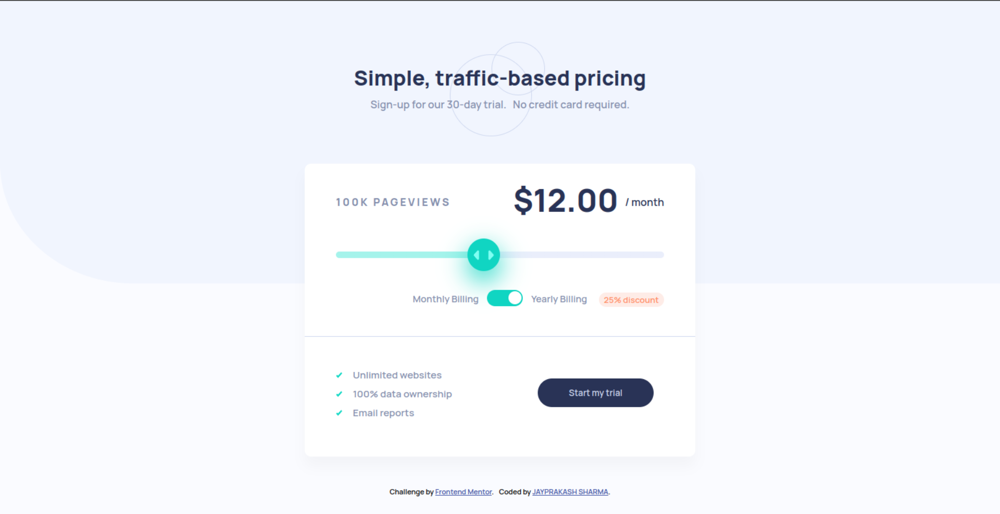
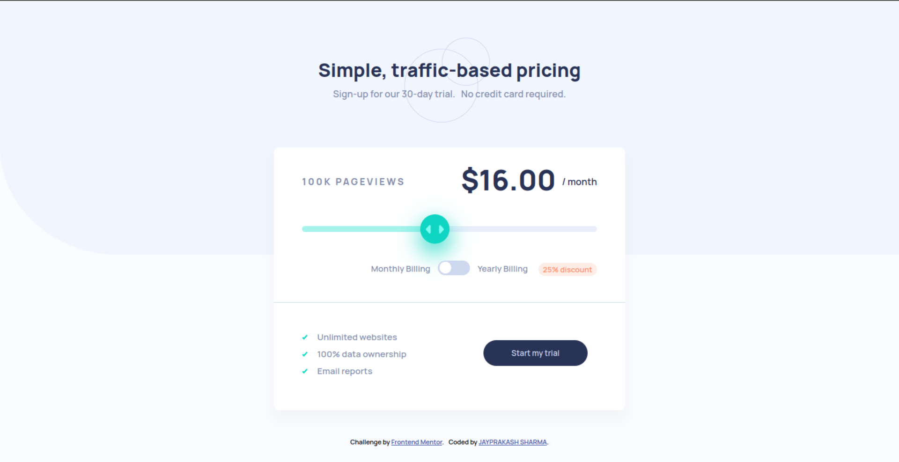

# Frontend Mentor - Interactive pricing component solution

This is a solution to the [Interactive pricing component challenge on Frontend Mentor](https://www.frontendmentor.io/challenges/interactive-pricing-component-t0m8PIyY8). Frontend Mentor challenges help you improve your coding skills by building realistic projects. 

## Table of contents

- [Overview](#overview)
  - [The challenge](#the-challenge)
  - [Screenshot](#screenshot)
  - [Links](#links)
- [My process](#my-process)
  - [Built with](#built-with)
  - [What I learned](#what-i-learned)
- [Author](#author)

## Overview

### The challenge

Users should be able to:

- View the optimal layout for the app depending on their device's screen size
- See hover states for all interactive elements on the page
- Use the slider and toggle to see prices for different page view numbers

### Screenshot





### Links

- Solution URL: [Get Solution](https://github.com/thejaysharma/Interactive-pricing-component)
- Live Site URL: [Live Site](https://thejaysharma.github.io/Interactive-pricing-component/)

## My process

### Built with

- Semantic HTML5 markup
- CSS custom properties
- Flexbox
- CSS Grid
- Mobile-first workflow

### What I learned

Implementing range slides and adjusting them for various browsers are new skills I've picked up. How to utilise a range slider with JavaScript and retrieve values from it.

To see how you can add code snippets, see below:

```html
<input type="range" min="0" max="100" step="1" value="0" oninput="RangeSlider(this.value)">
```
```js
function RangeSlider(value) {
  document.getElementById('rangeValue').innerHTML = value;
}
}
```

## Author

- Website - [Jay Prakash Sharma](https://www.your-site.com)
- Twitter - [@Jay_P_Sharma](https://www.twitter.com/Jay_P_Sharma)

